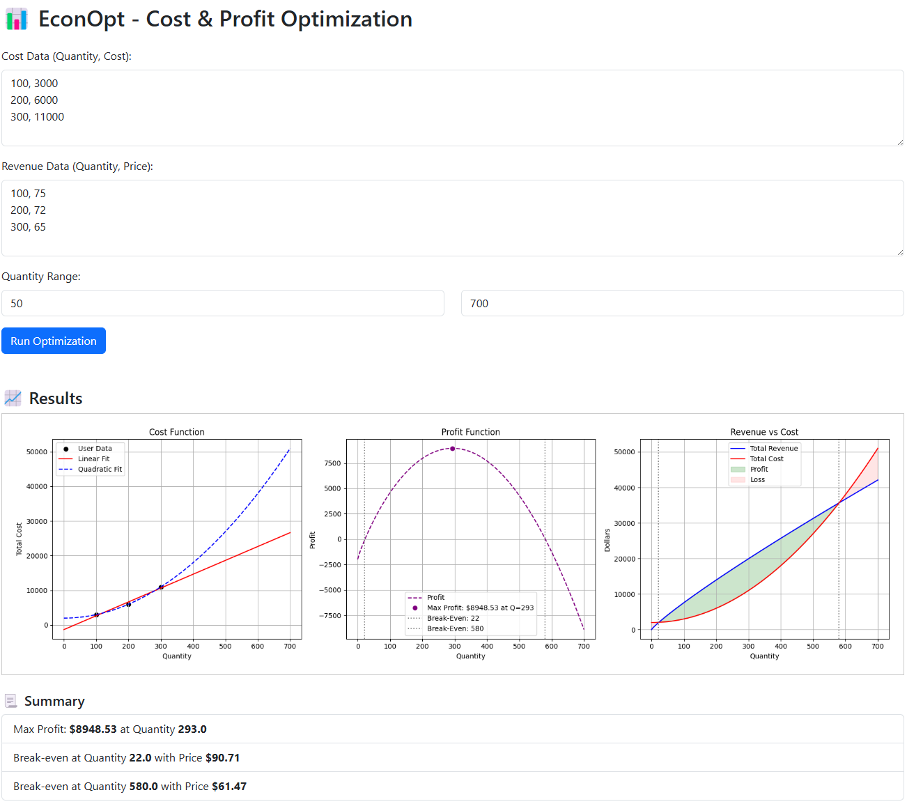

# 📊 EconOpt – Cost & Profit Optimization App

EconOpt is a Flask-based web application that helps you simulate and visualize cost, revenue, and profit functions. It fits user-input data, identifies break-even points, and finds the profit-maximizing output.

## 🚀 Features

- 📈 Dynamic graphs for Cost Function, Profit Function, and Revenue vs Cost
- 🔢 Fit models to user input (Linear, Quadratic, Nonlinear)
- 💰 Automatically identifies:
  - Break-even points
  - Maximum profit and corresponding quantity

## 🛠️ Tech Stack

- Python (Flask, NumPy, Matplotlib, SciPy)
- HTML5 + Bootstrap for UI

## 📸 Screenshot



## ▶️ How to Run Locally

1. Clone the repo:
   ```bash
   git clone https://github.com/ios79/EconOpt.git
   cd EconOpt
